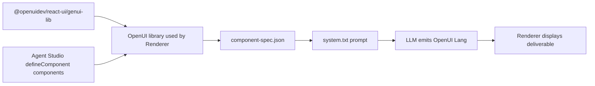

# OpenUI Component Catalog

This catalog documents the OpenUI component contract registered by Agent Studio
for runtime deliverable rendering.

The current generated contract contains **62 components**:

- **54 official OpenUI components** from `@openuidev/react-ui/genui-lib`
- **8 Agent Studio components** registered locally with `defineComponent`

The source of truth is:

- `agent-studio-frontend/src/openui/library.jsx`
- `agent-studio-frontend/src/openui/generated/component-spec.json`

Regenerate the catalog used by the LLM with:

```bash
cd agent-studio-frontend
npm run generate:openui
```

## Component Sources



Agent Studio intentionally disables tool-connected UI for runtime deliverables.
Components such as forms and buttons remain present because they are part of the
base library, but the translator prompt says not to emit `Query()`, `Mutation()`,
`@Run`, `@Set`, or `@Reset` for static JSON rendering.

## Agent Studio Components

These are local components implemented directly with `defineComponent`. They do
not wrap legacy Agent Studio chat widgets.

### Agent Studio Primitives

The file `agent-studio-frontend/src/openui/components/primitives.jsx` defines
small text-oriented conveniences.

| Component | OpenUI Lang Signature | Purpose |
|---|---|---|
| `Heading` | `Heading(text: string, level?: number)` | Section heading. Use levels `1` to `3` for visual hierarchy. |
| `Text` | `Text(text: string, emphasis?: "normal" \| "subtle" \| "strong")` | Plain prose paragraph. This is implemented by the local `TextContent` variable but registered as the OpenUI component name `Text`. |
| `Bullets` | `Bullets(items: string[])` | Simple bullet list for short string arrays. |
| `Code` | `Code(code: string, language?: string)` | Monospaced code or raw structured snippet. |
| `Link` | `Link(label: string, href: string)` | External hyperlink rendered inline. |

### Agent Studio Widgets

The file `agent-studio-frontend/src/openui/components/widgets.jsx` defines the
few domain gaps not covered by the official library.

| Component | OpenUI Lang Signature | Purpose |
|---|---|---|
| `TreeView` | `TreeView(data: {name?: string, title?: string, label?: string, role?: string, department?: string, children?: any[], attributes?: Record<string, any>}, title?: string)` | Native hierarchy viewer. Use for org charts, operating models, reporting lines, file trees, and any nested `children` structure. |
| `Slide` | `Slide(title: string, bullets?: string[], body?: string, subtitle?: string, layout?: "title-content" \| "title-only" \| "two-column")` | Presentation-style card for slide-shaped deliverables. |
| `QueryTrace` | `QueryTrace(queries: {name: string, query?: string, result?: any}[])` | Collapsible trace for visible query or tool provenance. Not for normal data display. |

## Official OpenUI Components

These come from `@openuidev/react-ui/genui-lib`.

### Layout And Containers

| Component | OpenUI Lang Signature | Purpose |
|---|---|---|
| `Stack` | `Stack(children: any[], direction?: "row" \| "column", gap?: "none" \| "xs" \| "s" \| "m" \| "l" \| "xl" \| "2xl", align?: "start" \| "center" \| "end" \| "stretch" \| "baseline", justify?: "start" \| "center" \| "end" \| "between" \| "around" \| "evenly", wrap?: boolean)` | Root layout and flex container. The library root is `Stack`, so every response starts with `root = Stack([...])`. |
| `Card` | `Card(children: (...components...)[], variant?: "card" \| "sunk" \| "clear", direction?: "row" \| "column", gap?: ..., align?: ..., justify?: ..., wrap?: boolean)` | Styled container for grouped content, KPIs, tables, charts, and summaries. |
| `CardHeader` | `CardHeader(title?: string, subtitle?: string)` | Standard title/subtitle header inside a `Card`. |
| `Tabs` | `Tabs(items: TabItem[])` | Tabbed container for alternate views or grouped subsections. |
| `TabItem` | `TabItem(value: string, trigger: string, content: (...components...)[])` | One tab in a `Tabs` component. |
| `Accordion` | `Accordion(items: AccordionItem[])` | Collapsible section group. |
| `AccordionItem` | `AccordionItem(value: string, trigger: string, content: (...components...)[])` | One accordion section. |
| `Steps` | `Steps(items: StepsItem[])` | Ordered step-by-step display for workflows, value chains, phases, or timelines. |
| `StepsItem` | `StepsItem(title: string, details: string)` | One item in `Steps`. |
| `Carousel` | `Carousel(children: (...components...)[][], variant?: "card" \| "sunk")` | Horizontal scrollable carousel of component groups. |
| `Separator` | `Separator(orientation?: "horizontal" \| "vertical", decorative?: boolean)` | Visual divider between content sections. |
| `Modal` | `Modal(title: string, open?: $binding<boolean>, children: (...components...)[], size?: "sm" \| "md" \| "lg")` | Modal dialog. Registered from the base library, but static deliverable translation should not emit reactive modal state. |

### Content Blocks

| Component | OpenUI Lang Signature | Purpose |
|---|---|---|
| `TextContent` | `TextContent(text: string, size?: "small" \| "default" \| "large" \| "small-heavy" \| "large-heavy")` | Official OpenUI text block. Supports markdown-like text and size emphasis. |
| `MarkDownRenderer` | `MarkDownRenderer(textMarkdown: string, variant?: "clear" \| "card" \| "sunk")` | Markdown rendering block. |
| `Callout` | `Callout(variant: "info" \| "warning" \| "error" \| "success" \| "neutral", title: string, description: string, visible?: $binding<boolean>)` | Callout banner. Static deliverables should use it without reactive visibility bindings. |
| `TextCallout` | `TextCallout(variant?: "neutral" \| "info" \| "warning" \| "success" \| "danger", title?: string, description?: string)` | Compact text callout. |
| `Image` | `Image(alt: string, src?: string)` | Image with alt text and optional source URL. |
| `ImageBlock` | `ImageBlock(src: string, alt?: string)` | Larger image block with loading state. |
| `ImageGallery` | `ImageGallery(images: {src: string, alt?: string, details?: string}[])` | Gallery grid with modal preview behavior. |
| `CodeBlock` | `CodeBlock(language: string, codeString: string)` | Syntax-highlighted code block. |
| `TagBlock` | `TagBlock(tags: string[])` | Simple group of text tags. Useful for strategy themes, priorities, capabilities, and governance bodies. |
| `Tag` | `Tag(text: string, icon?: string, size?: "sm" \| "md" \| "lg", variant?: "neutral" \| "info" \| "success" \| "warning" \| "danger")` | Single styled badge. |

### Tables

| Component | OpenUI Lang Signature | Purpose |
|---|---|---|
| `Table` | `Table(columns: Col[])` | Column-oriented data table. Prefer for arrays of objects with repeated keys. |
| `Col` | `Col(label: string, data: any, type?: "string" \| "number" \| "action")` | One table column. The `data` value should be an array aligned with the other columns. |

Example:

```text
table = Table([Col("Use case", names), Col("Value", values, "number")])
names = ["Revenue Intelligence", "Demand Forecasting"]
values = [5.4, 2.6]
```

### Charts

Charts require numeric arrays in the deliverable JSON. If the agent output only
contains prose, the translator should not invent chart values.

| Component | OpenUI Lang Signature | Purpose |
|---|---|---|
| `LineChart` | `LineChart(labels: string[], series: Series[], variant?: "linear" \| "natural" \| "step", xLabel?: string, yLabel?: string)` | Trend chart for ordered or time-based numeric series. |
| `AreaChart` | `AreaChart(labels: string[], series: Series[], variant?: "linear" \| "natural" \| "step", xLabel?: string, yLabel?: string)` | Filled trend chart for volumes or cumulative values. |
| `BarChart` | `BarChart(labels: string[], series: Series[], variant?: "grouped" \| "stacked", xLabel?: string, yLabel?: string)` | Vertical comparison chart for categories. |
| `HorizontalBarChart` | `HorizontalBarChart(labels: string[], series: Series[], variant?: "grouped" \| "stacked", xLabel?: string, yLabel?: string)` | Horizontal comparison chart. Prefer when category labels are long or ranking-oriented. |
| `RadarChart` | `RadarChart(labels: string[], series: Series[])` | Spider chart for comparing multiple variables across one or more entities. |
| `Series` | `Series(category: string, values: number[])` | One data series for `LineChart`, `AreaChart`, `BarChart`, `HorizontalBarChart`, or `RadarChart`. |
| `PieChart` | `PieChart(labels: string[], values: number[], variant?: "pie" \| "donut", appearance?: "circular" \| "semiCircular")` | Part-to-whole chart. Use for percentages or shares. |
| `RadialChart` | `RadialChart(labels: string[], values: number[])` | Radial bar visualization for categorical numeric values. |
| `SingleStackedBarChart` | `SingleStackedBarChart(labels: string[], values: number[])` | One stacked horizontal bar for part-to-whole values. |
| `Slice` | `Slice(category: string, value: number)` | One label/value slice helper. |
| `ScatterChart` | `ScatterChart(datasets: ScatterSeries[], xLabel?: string, yLabel?: string)` | X/Y plot for correlations, distributions, and clustering. |
| `ScatterSeries` | `ScatterSeries(name: string, points: Point[])` | One named scatter dataset. |
| `Point` | `Point(x: number, y: number, z?: number)` | Numeric point for scatter plots. Optional `z` can represent size/depth. |

Examples:

```text
line = LineChart(["Jun", "Jul", "Aug"], [Series("Benefit", [0.8, 1.7, 3.2])], "natural")
pie = PieChart(["Products", "Platform", "Governance"], [42, 28, 18], "donut")
bar = BarChart(["Use Case A", "Use Case B"], [Series("Value", [5.4, 3.1])])
```

### Forms And Inputs

These official components are registered by the base library, but the runtime
deliverable translator should not emit interactive forms for static deliverable
display.

| Component | OpenUI Lang Signature | Purpose |
|---|---|---|
| `Form` | `Form(name: string, buttons: Buttons, fields?: FormControl[])` | Form container with explicit action buttons. |
| `FormControl` | `FormControl(label: string, input: Input \| TextArea \| Select \| DatePicker \| Slider \| CheckBoxGroup \| RadioGroup, hint?: string)` | Label/input wrapper for form fields. |
| `Label` | `Label(text: string)` | Text label. |
| `Input` | `Input(name: string, placeholder?: string, type?: "text" \| "email" \| "password" \| "number" \| "url", rules?: {...}, value?: $binding<string>)` | Text-like input. |
| `TextArea` | `TextArea(name: string, placeholder?: string, rows?: number, rules?: {...}, value?: $binding<string>)` | Multiline text input. |
| `Select` | `Select(name: string, items: SelectItem[], placeholder?: string, rules?: {...}, value?: $binding<string>, size?: "small" \| "medium" \| "large")` | Dropdown input. |
| `SelectItem` | `SelectItem(value: string, label: string)` | One dropdown option. |
| `DatePicker` | `DatePicker(name: string, mode?: "single" \| "range", rules?: {...}, value?: $binding<any>)` | Date picker input. |
| `Slider` | `Slider(name: string, variant: "continuous" \| "discrete", min: number, max: number, step?: number, defaultValue?: number[], label?: string, rules?: {...}, value?: $binding<number[]>)` | Numeric slider. |
| `CheckBoxGroup` | `CheckBoxGroup(name: string, items: CheckBoxItem[], rules?: {...}, value?: $binding<Record<string, boolean>>)` | Group of checkbox options. |
| `CheckBoxItem` | `CheckBoxItem(label: string, description: string, name: string, defaultChecked?: boolean)` | One checkbox option. |
| `RadioGroup` | `RadioGroup(name: string, items: RadioItem[], defaultValue?: string, rules?: {...}, value?: $binding<string>)` | Radio input group. |
| `RadioItem` | `RadioItem(label: string, description: string, value: string)` | One radio option. |
| `SwitchGroup` | `SwitchGroup(name: string, items: SwitchItem[], variant?: "clear" \| "card" \| "sunk", value?: $binding<Record<string, boolean>>)` | Group of switches. |
| `SwitchItem` | `SwitchItem(label?: string, description?: string, name: string, defaultChecked?: boolean)` | One switch option. |

### Buttons

| Component | OpenUI Lang Signature | Purpose |
|---|---|---|
| `Button` | `Button(label: string, action?: ActionExpression, variant?: "primary" \| "secondary" \| "tertiary", type?: "normal" \| "destructive", size?: "extra-small" \| "small" \| "medium" \| "large")` | Clickable button. Static deliverables should avoid action wiring. |
| `Buttons` | `Buttons(buttons: Button[], direction?: "row" \| "column")` | Group of buttons. |

## Practical Selection Guide

- Use `Table` and `Col` for arrays of objects with repeated keys.
- Use `LineChart` for `month`, `date`, or ordered trend arrays with numeric values.
- Use `PieChart` or `SingleStackedBarChart` for percentage/share breakdowns.
- Use `BarChart` or `HorizontalBarChart` for category comparisons and rankings.
- Use `TreeView` only when the JSON contains nested `children`, `org_tree`,
  hierarchy, or reporting-line data.
- Use `Card`, `CardHeader`, `TextContent`, `TagBlock`, `Steps`, and `Bullets`
  for prose, lists, stages, and summaries.
- Do not use interactive form/button/tool components for runtime deliverable
  rendering unless a future feature explicitly wires a `toolProvider`.
