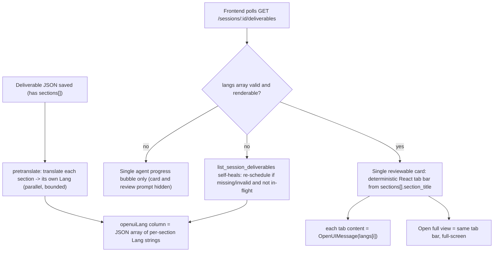

# Runtime OpenUI Deliverables

Agent Studio uses OpenUI only as a **runtime presentation layer** for structured
deliverables. The deliverable JSON stays the source of truth; OpenUI Lang is a
derived render artifact persisted on the deliverable row.

## Architecture

Each deliverable is translated section-by-section into OpenUI Lang by a
background task after it is saved, and the per-section Lang strings are stored
as a JSON array on `agent_deliverable.openuiLang`. The frontend builds a
deterministic tab bar from the deliverable's `sections[]` and renders one Lang
per tab. There is no runtime translate API and no render cache table.



The translation order: each `sections[i]` (`{section_title, description,
content}`) is translated independently and in parallel under a small
concurrency bound, so an 8-section deliverable never opens 8 simultaneous proxy
calls. A non-sectioned deliverable produces a single-element array, so the
frontend has exactly one rendering path. A section that fails translation is
stored as an empty string and rendered as a read-only JSON fallback.

For pending human-in-the-loop deliverables, the frontend blocks further chat but
does not show the "review pending deliverable" state until `openuiLang` is
renderable. While translation is still running, the card and review prompt stay
hidden so users are not sent to a hidden or empty review target.

## What Stays JSON

- `submit_deliverable` payloads
- HITL approve/reject data
- PowerPoint/template export data
- downstream agent context
- database deliverable rows

`openuiLang` is the only derived field. It holds a plain JSON array of per-section
Lang strings (`["root = ...", "root = ...", ...]`), index-aligned to
`sections[]`. There is no envelope object, no version/kind/status metadata, and
no legacy plain-string format. Rows that do not parse as a renderable array are
treated as not-ready and re-translated on the next read.

## Prompt Generation

The frontend owns the OpenUI component library in:

- `agent-studio-frontend/src/openui/library.jsx`
- `agent-studio-frontend/src/openui/components/`

The library starts from the official `@openuidev/react-ui/genui-lib`
`openuiLibrary`, which provides general-purpose layout, content, table, chart,
form, button, tag, tab, accordion, carousel, and step components. Agent Studio
then adds only native gap-filling components with `defineComponent`: `TreeView`
for hierarchy/org structures, `Slide` for presentation-shaped deliverables, and
`QueryTrace` for query/tool provenance.

Custom OpenUI components should not import or wrap legacy Agent Studio chat
renderers. Domain visualizations such as `TreeView` are implemented directly in
the OpenUI layer.

See `docs/openui-components.md` for the full component catalog.

### Component Inventory

The runtime library intentionally combines the official OpenUI general library
with a small Agent Studio extension set:

- Layout and containers: `Stack`, `Card`, `CardHeader`, `Tabs`, `TabItem`,
  `Accordion`, `AccordionItem`, `Steps`, `StepsItem`, `Carousel`, `Separator`,
  `Modal`
- Content blocks: `TextContent`, `MarkDownRenderer`, `Callout`, `TextCallout`,
  `TagBlock`, `Tag`, `CodeBlock`, `Image`, `ImageBlock`, `ImageGallery`
- Tables: `Table`, `Col`
- Charts: `LineChart`, `AreaChart`, `BarChart`, `HorizontalBarChart`,
  `PieChart`, `RadarChart`, `RadialChart`, `SingleStackedBarChart`,
  `ScatterChart`, `Series`, `ScatterSeries`, `Point`
- Forms and buttons from the base library remain registered, but runtime
  deliverable generation disables tool calls and bindings so static deliverables
  do not emit live tool-connected UI.
- Agent Studio text conveniences: `Heading`, `Text`, `Bullets`, `Code`, `Link`
- Agent Studio native domain gaps: `TreeView`, `Slide`, `QueryTrace`

`Query()`, `Mutation()`, `@Run`, `@Set`, and `@Reset` are intentionally disabled
for this runtime deliverable path. Workflow tools already ran before the
deliverable was submitted, so OpenUI receives static JSON and turns it into a
view only.

Prompt guidance is intentionally small and lives in
`agent-studio-frontend/src/openui/prompt-options.mjs`, which is imported by
both `library.jsx` and the prompt generation script.

Generate the component spec and prompt with:

```bash
cd agent-studio-frontend
npm run generate:openui
```

This writes `system.txt` and `manifest.json` to both the frontend generated
folder and the backend prompt folder:

- `agent-studio-frontend/src/openui/generated/system.txt`
- `agent-studio-frontend/src/openui/generated/manifest.json`
- `agent-studio-backend/app/services/openui_prompts/system.txt`
- `agent-studio-backend/app/services/openui_prompts/manifest.json`

The manifest includes `componentSpecHash` and `promptHash`. The backend uses
these hashes for health reporting. It does not import frontend code or require
Node at runtime.

## Backend: per-section translation

Backend files:

- `agent-studio-backend/app/services/openui_prompt.py` - loads `system.txt`
- `agent-studio-backend/app/services/openui_translate_service.py` -
  `translate_json_to_openui_lang` (single unit) and
  `translate_deliverable_section_langs` (parallel per-section array)
- `agent-studio-backend/app/services/chat_service.py` - schedules and persists
  pretranslation, plus the self-heal helper
- `agent-studio-backend/app/routers/openui_routes.py` - health probe only

Endpoint:

- `GET /api/openui/health` - verifies the OpenUI system prompt is present

Translation flow:

- `_schedule_pretranslation` fires a background task after a deliverable is
  saved (skipping code-executor / powerpoint-generator and non-OpenUI output
  types). An in-flight guard keyed by deliverable id prevents duplicate calls
  when the post-save schedule and a self-heal poll overlap.
- `translate_deliverable_section_langs` translates each section in parallel
  under `asyncio.Semaphore`, with one retry per section, and returns a list of
  Lang strings aligned to `sections[]` (a failed section becomes `""`).
- The result is persisted as `json.dumps(langs)` on the `openuiLang` column via
  `DeliverableRepository.save_openui_lang`.
- `DeliverableService.list_session_deliverables` self-heals on read: any
  deliverable that needs OpenUI but whose `openuiLang` is missing or not a
  renderable array is re-scheduled (guarded by the same in-flight set).

Model selection:

```bash
OPENUI_TRANSLATE_MODEL=openai.eu.gpt-5.5
OPENUI_TRANSLATE_MAX_TOKENS=8192
OPENUI_PRETRANSLATE_ENABLED=true
```

If unset, the translator falls back to `DEFAULT_LLM_MODEL`, then
`openai.gpt-5.4-mini`. Translating per section (rather than one large
8-section call) keeps each call small and avoids truncating the OpenUI Lang.

## Frontend Rendering

Frontend files:

- `agent-studio-frontend/src/openui/resolveOpenUILang.js` - parses the column
- `agent-studio-frontend/src/openui/DeliverableOpenUIView.jsx` - tab bar
- `agent-studio-frontend/src/openui/OpenUIMessage.jsx` - single-Lang renderer
- `agent-studio-frontend/src/components/chat/ChatView.jsx`
- `agent-studio-frontend/src/components/chat/DeliverableReview.jsx`

Behavior:

- `resolveOpenUILang.js` parses `openuiLang` ONLY as a JSON array of Lang
  strings and pairs `langs[i]` with `sections[i].section_title`. A deliverable
  is "ready" when the array has at least one renderable `root = ...` entry.
- `DeliverableOpenUIView` renders a deterministic React tab bar (one tab per
  section, labelled by `section_title`). A single section renders directly with
  no tab bar. The same component is used inline and in the expanded modal, so
  the two views are always identical (expanded is just larger).
- While a deliverable is not ready, the inline card is hidden and the agent is
  represented by a single progress bubble (no "Preparing OpenUI view" text).
- On a fatal OpenUI parse error for a section, the view renders a clean
  read-only JSON view of that section instead of an error panel.
- Normal agent/system chat remains markdown with citations; code-executor
  deliverables keep their existing renderer.

## Export Strategy

The expanded deliverable view exposes export actions as flat, self-explanatory
buttons (no dropdown):

- **Export PDF / Export Word**: generated from the structured JSON deliverable,
  because those formats need stable pagination, document semantics, and
  deterministic styling.
- **Export HTML**: captures the *live OpenUI render* (all sections) by mounting
  an off-screen surface, serializing the rendered DOM with inlined computed
  styles, and downloading a standalone `.html` file that visually matches the
  on-screen widgets (see `src/openui/exportOpenUIHtml.js`).
- **Create Presentation in Edwin**: on-demand handoff that formats the
  deliverable as markdown and creates an Edwin session
  (`POST /api/chat/deliverables/{id}/edwin-handoff`), then opens the returned
  Edwin URL. This mirrors the `powerpoint_generator` workflow node but is
  user-triggered.
- **Fill PowerPoint Template**: shown only when the agent node has a PowerPoint
  template configured.

The native AI PowerPoint generator (`PowerPointModal`) is retained in the
codebase but is no longer surfaced in the export controls.

## Workflow Testing Notes

OpenUI can only render charts when the saved agent output schema produces
chart-ready numeric arrays. Prompt text such as "include a monthly benefit
trend" is not enough if the agent node's `outputSchema` still only contains
overview or org-structure fields. For charts, add numeric fields (for example
`monthly_benefits`, `investment_mix`) to the agent node's **Output Schema
(JSON)**, then save the workflow and start a fresh test session.

After changing prompt/component code in local development, restart the backend
so its cached `system.txt` loader refreshes, and hard-refresh the browser if a
previous render is still visible.

## Out of Scope

- OpenUI in agent system prompts
- OpenUI as a publish/build-time feature
- OpenUI Lang stored as the deliverable source of truth
- tracing/chat streaming format changes

## Troubleshooting

- `503` from `/api/openui/health`: run `npm run generate:openui`.
- stale rendering after component edits: rerun `npm run generate:openui` and
  restart the backend in dev so cached prompt metadata is refreshed.
- model access errors: set `OPENUI_TRANSLATE_MODEL` to a model allowed by the
  GenAI proxy key.
- a section shows raw JSON instead of a rendered view: the LLM emitted an
  unknown component or malformed OpenUI Lang for that section; it will be
  re-translated by the self-heal path on the next deliverables fetch.
```
